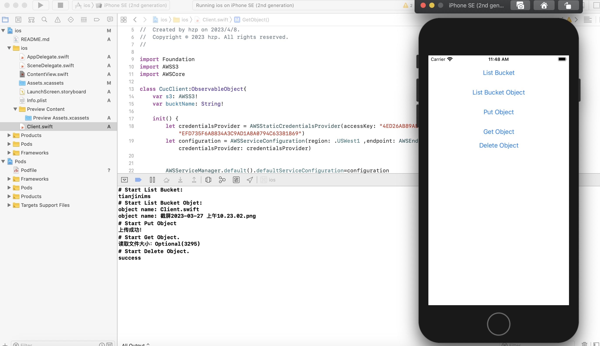

## swift示例项目
1. 创建项目
打开xcode，右上角 `File -> New -> Project`。选择App，语言选择swift。(示例项目中的名称为ios-swift，后续以此名称为例子)。
cd工程项目目录下（与ios-swift.xcodeproj同级目录）：
```
pod init
```
生成Podflie，将以下内容追加写入PodFile:
```
target 'ios-swift' do
    pod 'AWSMobileClient'
    pod 'AWSPinpoint'
end
```
执行
```
pod install --repo-update
```
## 开始使用
链接对象存储服务  
```swift
let credentialsProvider = AWSStaticCredentialsProvider(accessKey: "<your ak>", secretKey: "<your sk>")
let configuration = AWSServiceConfiguration(region: .USWest1 ,endpoint: AWSEndpoint(urlString: "<bucket endpoint>"), credentialsProvider: credentialsProvider)
AWSServiceManager.default().defaultServiceConfiguration=configuration
self.bucktName = "<your bucket>"
self.s3 = AWSS3.default()
```
列举用户下的bucket  
```swift
let req: AWSS3ListBucketInventoryConfigurationsRequest = AWSS3ListBucketInventoryConfigurationsRequest()
self.s3.listBuckets(req).continueWith(block: {(task) ->AnyObject? in
    for o in (task.result?.buckets)!{
        print(o.name ?? "null")
    }
    return nil
})
```
列举bucket下的对象
```swift
let req: AWSS3ListObjectsRequest = AWSS3ListObjectsRequest()
req.bucket = self.bucktName
self.s3.listObjects(req).continueWith(block: {(task)->AnyObject? in
    for o in (task.result?.contents)!{
        print("object name: \(String(o.key!))")
    }
    return nil
})
```
简单上传对象
```swift 
let req = AWSS3PutObjectRequest()!
req.bucket = self.bucktName
req.key = "Client.swift"

let data = try! String(contentsOfFile:"/Users/tharp/Desktop/CucObsSample/ios/ios/Client.swift", encoding: String.Encoding.utf8)
req.body = data
req.contentLength = NSNumber(value: data.count)
let semaphore = DispatchSemaphore(value: 0)

s3.putObject(req) { result, error in
    defer {
        semaphore.signal()
    }
    if let e = error {
       print(e)
        return
    }
    guard result != nil else {
        print ("Result unexpectedly nil")
        return
    }
    print("上传成功！")
}
semaphore.wait()
return
```
获取对象
```swift
let req = AWSS3GetObjectRequest()!
req.bucket = self.bucktName
req.key = "Client.swift"

self.s3.getObject(req){result, error in
    if let e = error{
        print(e)
    }else{
        print("读取文件大小：\(String(describing: result?.contentLength))")
    }
}
```
删除对象
```swift
let req = AWSS3DeleteObjectRequest()!
req.bucket = self.bucktName
req.key = "Client.swift"
self.s3.deleteObject(req){result, error in
    if let e = error{
        print(e)
    }else{
        print("success")
    }
}
```
示例结果：

